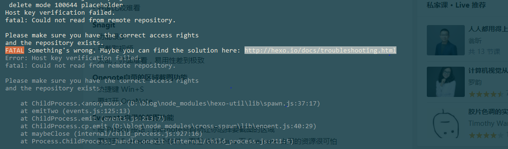

以前都是在看别人写的博客，现在有时间了，来记录一下生活工作的点点滴滴把。

# 现记录一个初次使用hexo遇到的问题
搞了一晚上，这个东西还是有点点坑，尤其是windows用户，如何配这些hexo,githubPages这些就不多少了，网上教程很多的，直接上问题。

## hexo d发布blog的时候，报git crlf相关错误
这是换行符问题，windows和是unix，linux系列的使用不同的换行符。。。

解决办法：
  1. 先删除.deploy_git目录
  2. git config --global core.autocrlf false
  3. hexo clean
  4. hexo g
  5. hexo d

## 使用git 管理hexo 以及 发布的blog

在同一个仓库创建一个master hexo分支，这个知乎上有介绍，大家可以去产看一下，操作比较简单。这是地址(https://www.zhihu.com/question/21193762)。